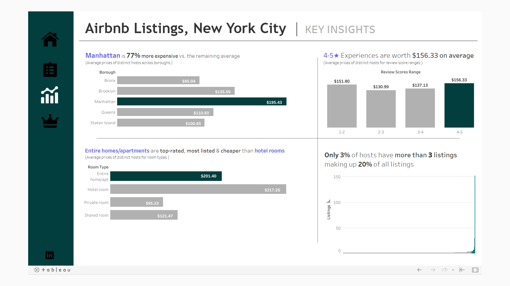

# Airbnb Listings Analysis in New York City

This project focuses on analyzing Airbnb listings in New York City to uncover insights into the hosting patterns, neighborhood preferences, and pricing strategies across different boroughs. Utilizing SQL for data querying and Python for data visualization, this analysis aims to provide a comprehensive overview of the Airbnb landscape in New York City.

## Project Structure

- `Airbnb correlation.ipynb`: Jupyter notebook containing the data analysis and visualization code.
- `README.md`: This file, providing an overview of the project.
- `screenshots/`: Directory containing screenshots of visualizations and outputs.
- `SQLQuery_Airbnb_NewYork.sql`: SQL queries used for data extraction and initial analysis.
- `Updated Neighbourhoods.xlsx`: Excel file with updated neighborhood information.

## Getting Started

To run this project, you will need to have SQL Server and Jupyter Notebook installed on your machine. The analysis is split between SQL for data querying and Python for data visualization.

### Prerequisites

- SQL Server: For executing the SQL queries.
- Python: With Jupyter Notebook for running the `.ipynb` file.
- Libraries: pandas, matplotlib, seaborn (for Python).

### Installation

1. Clone the repository to your local machine.
2. Ensure SQL Server is set up and the database `DataAnalysis` is accessible.
3. Install the required Python libraries using pip:

```sh
pip install pandas matplotlib seaborn
```

4. Open the Airbnb correlation.ipynb in Jupyter Notebook to view the analysis.

### Viewing the Data

* Querying in SSMS (SQL Server Management Studio) using self joins, CTEs, procedures, and group by to view the data required.
* Data Cleaning
* Data Analysis (Q/A)
* Data Transformation for dashboard visualization

### Dashboard

* **Overview:** Listings, accommodations available, average price ($), average rating, and total reviews info per borough.
* **Filtering:** Options to find the desired location and attaching links to the website for more details.
* **Key Insights:** Displaying insights on the boroughs, room types, prices, reviews, and hosts.
* **Superhosts vs. Non-Superhosts:** Analyzing the edge of superhosts.





## Analysis Overview

The SQL queries focus on extracting detailed information about hosts, listings, and reviews from the `DataAnalysis` database. The analysis covers:

- Identifying hosts living in the same neighborhoods as their listings.
- Analyzing pricing strategies across different neighborhoods.
- Visualizing correlations between various factors such as price, number of reviews, and accommodations.

The Python notebook further explores these insights through visualizations, providing a clearer understanding of the data.

## Tech Stack

- Excel
- SQL (SQL Server Management Studio)
- Tableau
- Figma
- Mapbox
- Python (pandas, seaborn, matplotlib)

## Contributing

Contributions to this project are welcome. Please feel free to fork the repository and submit pull requests.

## Links

- [Tableau Dashboard](https://public.tableau.com/app/profile/sujay.bahumik/viz/AirbnbListingsNewYorkCity/Home#1)
- [SQL Queries](https://github.com/s1dewalker/Airbnb-listings-NYC/blob/main/SQLQuery_Airbnb_NewYork.sql)
- [Python Notebook](https://github.com/s1dewalker/Airbnb-listings-NYC/blob/main/Airbnb%20correlation.ipynb)

---

